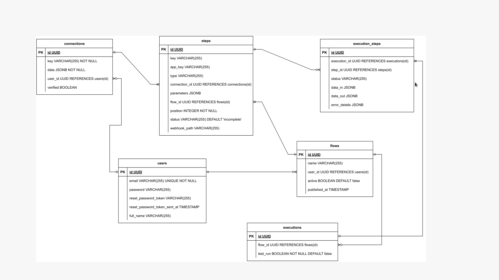

# Entity-Relationship Diagram (ERD) for Integration Hub

This directory contains the Entity-Relationship Diagram (ERD) for the Integration Hub project. The ERD provides a visual representation of the database structure using Crow's Foot notation.

## ERD Diagram

## ERD Description

The ERD illustrates the relationships between different tables in the Integration Hub database. Each table is represented as an entity, and the relationships between entities are depicted using lines connecting the entities. The Crow's Foot notation is used to indicate the cardinality and nature of the relationships.

## Tables Description

- **users:** Represents user information including email, password, and full name.
- **connections:** Stores information about external connections, including keys, data, and verification status.
- **steps:** Contains details about integration steps, such as keys, types, and parameters.
- **flows:** Represents integration flows with attributes like name, activation status, and publication timestamp.
- **executions:** Stores execution details including the flow ID and whether it's a test run.
- **execution_steps:** Contains execution step information, including status, input/output data, and error details.

